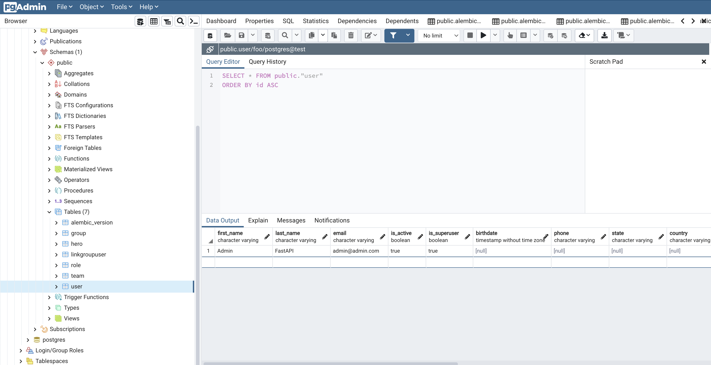
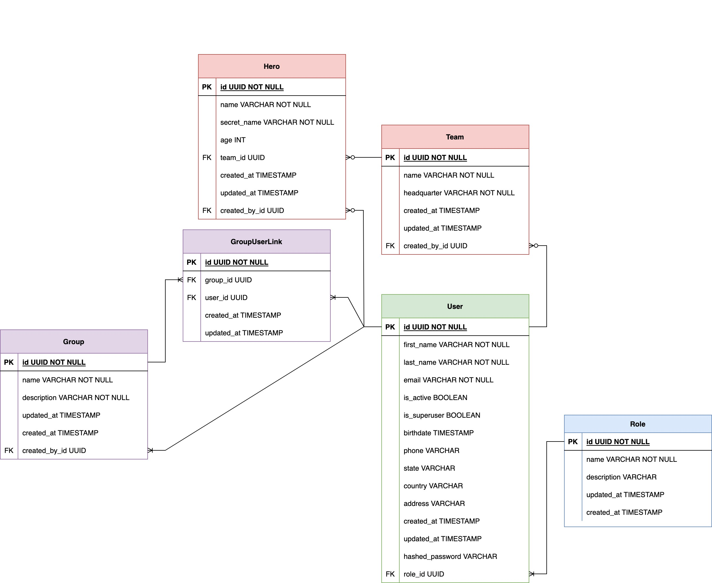
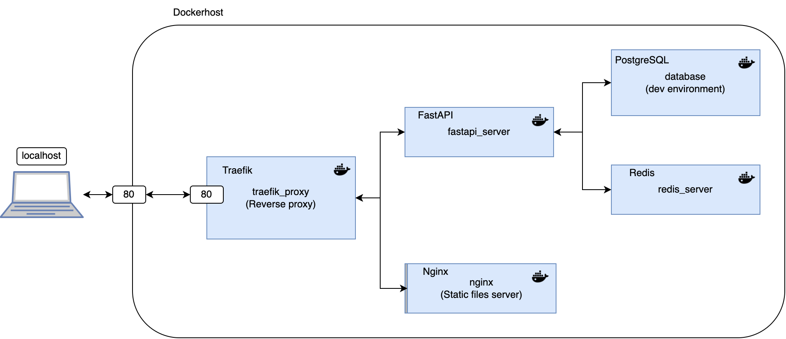
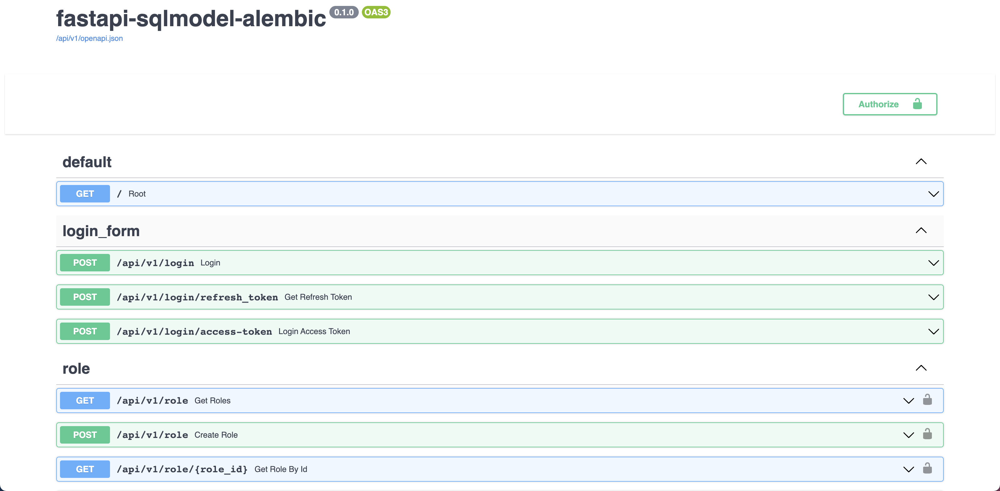
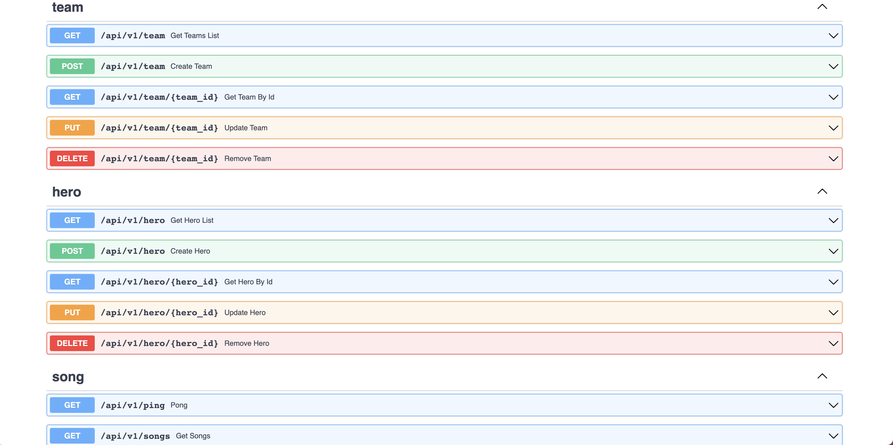
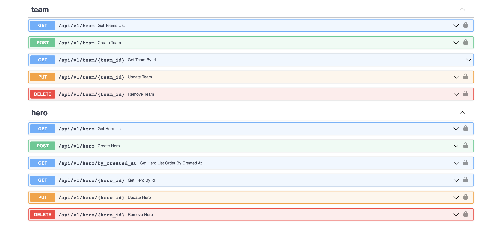
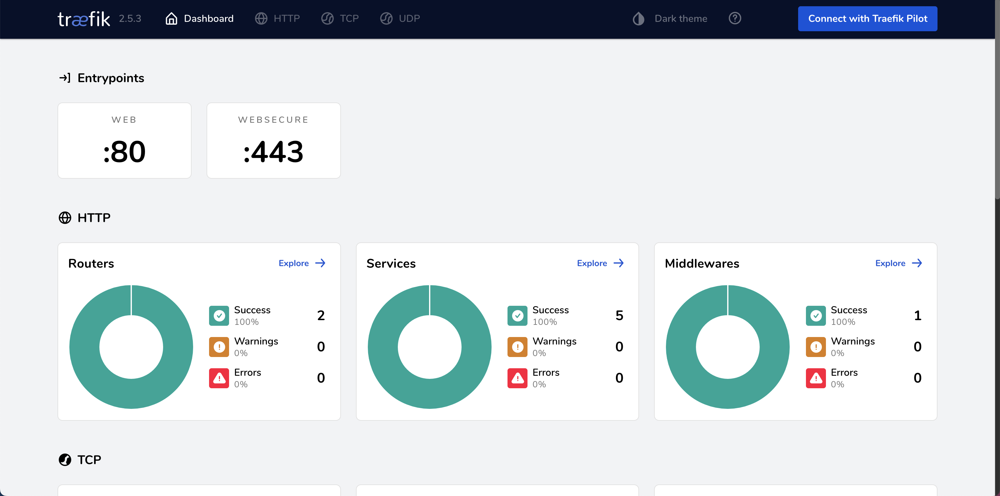
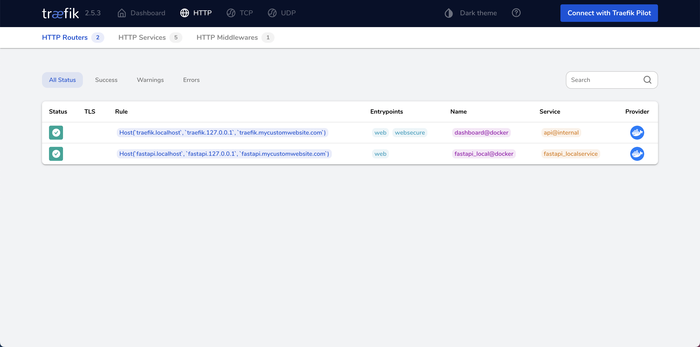

# Async configuration for FastAPI and SQLModel

This is a project template which uses [FastAPI](https://fastapi.tiangolo.com/), [Alembic](https://alembic.sqlalchemy.org/en/latest/) and async [SQLModel](https://sqlmodel.tiangolo.com/) as ORM. It shows a complete async CRUD template using authentication.

## Set environment variables

Create an **.env** file on root folder and copy the content from **.env.example**. Feel free to change it according to your own configuration.

## Run project using Docker compose

```sh
docker compose -f docker-compose-dev.yml up --build
```

## Setup database with initial data
This creates a sample users on database.
```
docker compose -f docker-compose-dev.yml exec fastapi_server python app/initial_data.py
```

- **Admin credentials ->** *username:* admin@admin.com and *password:* admin 
- **Manager credentials ->** *username:* manager@example.com and *password:* admin 
- **User credentials ->** *username:* user@example.com and *password:* admin 

You can connect to the Database using PGAdmin4 and use the credentials from .env file. Database port on local machine has been configured to **5454** on docker-compose-dev.yml file

<p align="center">
  
</p>

## ERD Database model
<p align="center">
  
</p>

## Containers architecture
<p align="center">
  
</p>

As this project uses [traefik](https://doc.traefik.io/traefik/routing/routers/) as reverse proxy, which uses namespaces routing, you can access to the documentation with the following path [http://fastapi.localhost/docs](http://fastapi.localhost/docs)

## Preview
  
<p align="center">
  
</p>
<p align="center">
  
</p>
<p align="center">
  
</p>

## Traefik Dashboard
Traefik has been configurated as reverse proxy on the ingress of the project; you can access to Traefik Dashboard using the following link [http://traefik.localhost/](http://traefik.localhost/). You should use **username: test** and **pass: test**. If you want to change the password, you can find more information of how to do it [here](https://doc.traefik.io/traefik/operations/api/)

<p align="center">
  
</p>
<p align="center">
  
</p>

## Static files
All files on static folder will be server by nginx container as static files. You can check it with this link [http://nginx.localhost/1.png](http://nginx.localhost/1.png)

## Run Alembic migrations (Only if you change the DB model)

```sh
docker compose -f docker-compose-dev.yml exec fastapi_server alembic revision --autogenerate
docker compose -f docker-compose-dev.yml exec fastapi_server alembic upgrade head
```

## Production Deployment
Remember to use a persistant PostgreSQL database, update the new credentials on .env file and use this command to run the project in a production environment. For testing this configuration on localhost you can uncomment the database container and 
depends_on of fastapi container otherwise it will not work on a local environment.

```sh
docker compose up --build
```

## Inspiration and References

- [full-stack-fastapi-postgresql](https://github.com/tiangolo/full-stack-fastapi-postgresql).
- [fastapi-sqlmodel-alembic](https://github.com/testdrivenio/fastapi-sqlmodel-alembic).
- [sqlmodel-tutorial](https://sqlmodel.tiangolo.com/tutorial/fastapi/).
- [fastapi-pagination](https://github.com/uriyyo/fastapi-pagination).
- [fastapi-cache](https://github.com/long2ice/fastapi-cache).
- [fastapi-keycloak](https://github.com/code-specialist/fastapi-keycloak).
- [fastapi-async-sqlalchemy](https://github.com/h0rn3t/fastapi-async-sqlalchemy).
- [fastapi-best-practices](https://github.com/zhanymkanov/fastapi-best-practices).

## TODO List:

- [x] Add Custom Response model
- [x] Create sample one to many relationship
- [x] Create sample many to many relationship
- [x] Add JWT authentication
- [x] Add Pagination
- [x] Add User birthday field with timezone
- [x] Add reverse proxy (traefik) with docker compose
- [x] Add static server with nginx
- [x] Add basic RBAC (Role base access control)
- [x] Add sample heroes, teams and groups on init db
- [x] Add cache configuration using fastapi-cache2 and redis
- [x] Create a global database pool of sessions to avoid to pass the session as dependency injection on each handle
- [x] Refactor tablename to Pascal case
- [ ] Add one to one relationship sample
- [ ] Install pg_trgm by code and add a query for smart search of users by name
- [ ] Add Enum sample column
- [ ] Add jsonb field on table sample
- [ ] Add AuthN and AuthZ using Keycloak
- [ ] Add instructions for production deployment using github actions and dockerhub (CI/CD)
- [ ] Convert repo into template using cookiecutter
- [ ] Add Celery sample for tasks


PR are welcome ❤️

## License

[](http://badges.mit-license.org)

- This project is licensed under the terms of the **[MIT license](LICENSE)**