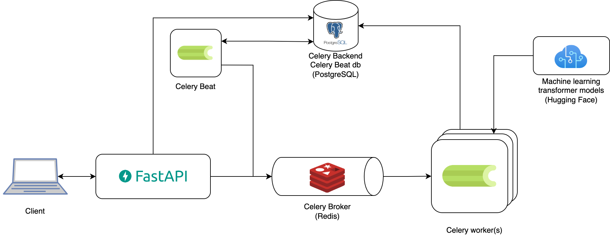
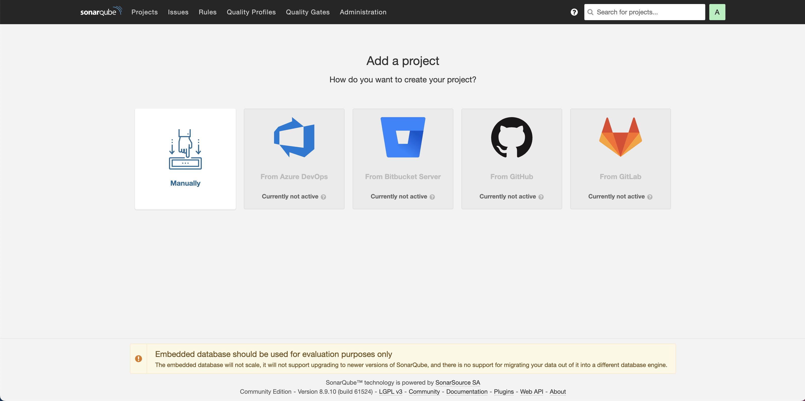
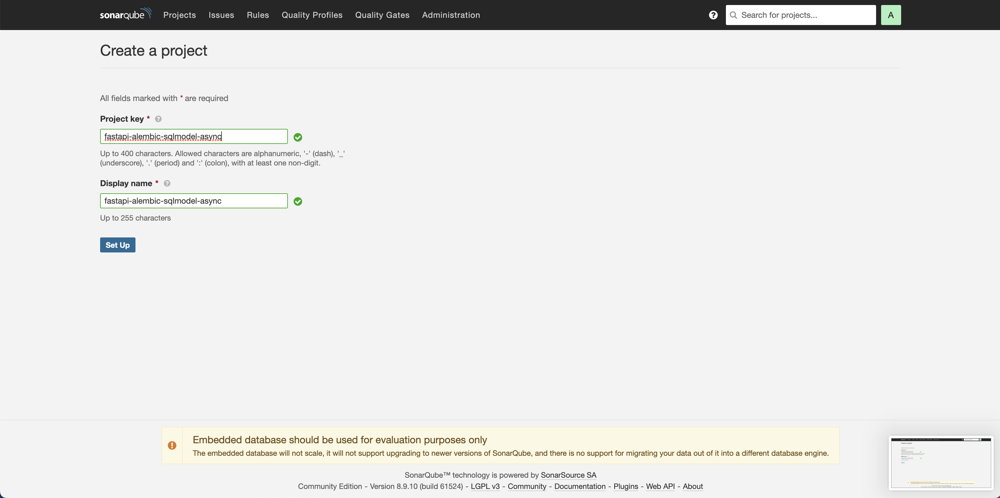
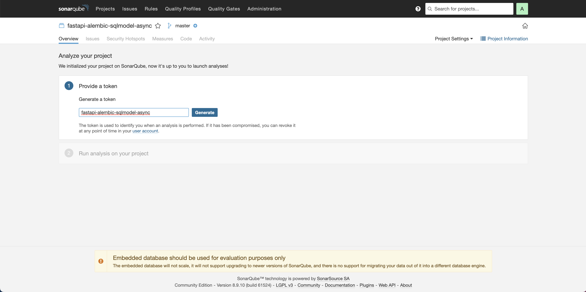
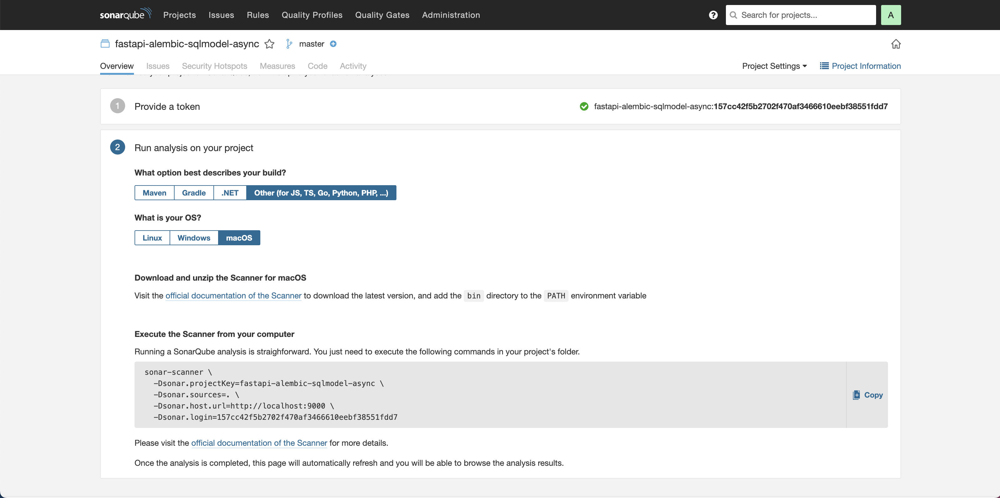
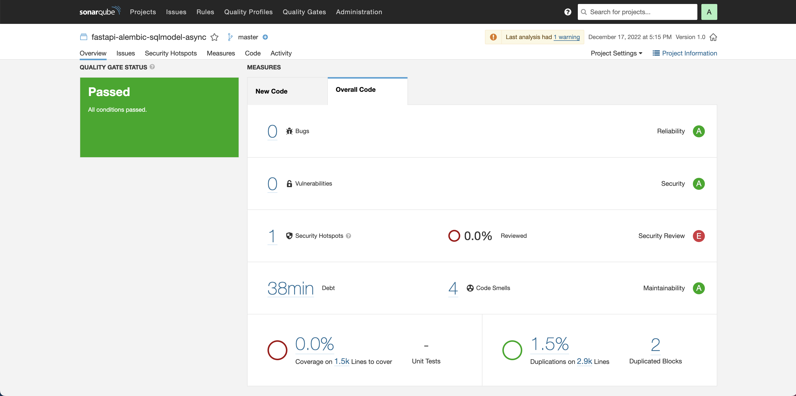

# Async configuration for FastAPI and SQLModel

This is a project template which uses [FastAPI](https://fastapi.tiangolo.com/), [Alembic](https://alembic.sqlalchemy.org/en/latest/) and async [SQLModel](https://sqlmodel.tiangolo.com/) as ORM which already is compatible with [Pydantic V2](https://docs.pydantic.dev/2.5/) and [SQLAlchemy V2.0](https://docs.sqlalchemy.org/en/20/). It shows a complete async CRUD template using authentication. Our implementation utilizes the newest version of FastAPI and incorporates typing hints that are fully compatible with **Python >=3.10**. If you're looking to build modern and efficient web applications with Python, this template will provide you with the necessary tools to get started quickly. You can read a short article with the motivations of starting this project in [Our Journey Using Async FastAPI](https://medium.com/allient/our-journey-using-async-fastapi-to-harnessing-the-power-of-modern-web-apis-90301827f14c?source=friends_link&sk=9006b3f2a4137a28a8576a69546c8c18). If you are looking for a started template CLI, I recommend you to use [create-fastapi-project](https://github.com/allient/create-fastapi-project)

## Why Use This Template?

Developing web applications can be a challenging process, especially when dealing with databases, authentication, asynchronous tasks, and other complex components. Our template is designed to simplify this process and offer you a solid starting point. Some of the highlights of this template include:

- FastAPI Integration: FastAPI is a modern and efficient web framework that allows you to quickly and easily create APIs. This template uses the latest features of FastAPI and offers type hints that are compatible with **Python 3.10** and later versions.
- Asynchronous Database Management: We use SQLModel, an asynchronous ORM library, to interact with the database efficiently and securely.
- Asynchronous Tasks with Celery: This template includes examples of how to execute asynchronous and scheduled tasks using Celery, which is ideal for operations that require significant time or resources.
- Authentication and Authorization: We implement JWT-based authentication and role-based access control to ensure that your APIs are secure and protected.
- Documentation and Automated Testing: The template is configured to automatically generate interactive documentation for your APIs. It also includes automated tests using pytest to ensure code quality.
- Development Best Practices: We apply code formatting, type checking, and static analysis tools to ensure that the code is readable, robust, and reliable.

## Table of Contents
1. [Set environment variables](#set-environment-variables)
2. [Run the project using Docker containers and forcing build containers](#run-the-project-using-docker-containers-and-forcing-build-containers)
3. [Run project using Docker containers](#run-project-using-docker-containers)
4. [Setup database with initial data](#setup-database-with-initial-data)
5. [ERD Database model](#erd-database-model)
6. [Containers architecture](#containers-architecture)
7. [Preview](#preview)
8. [Static files](#static-files)
9. [Minio server](#minio-server)
10. [Celery](#celery)
11. [Run Alembic migrations (Only if you change the DB model)](#run-alembic-migrations-only-if-you-change-the-db-model)
12. [Production Deployment](#production-deployment)
13. [Database unique IDs](#database-unique-ids)
14. [Code Style](#code-style)
15. [SonarQube static analysis](#sonarqube-static-analysis)
16. [Testing](#testing)
17. [Type checker](#type-checker)
18. [Basic chatbot example with Langchain and OpenAI](#basic-chatbot-example-with-langchain-and-openai)
19. [Inspiration and References](#inspiration-and-references)
20. [TODO List](#todo-list)
21. [License](#license)

## Set environment variables

Create an **.env** file on root folder and copy the content from **.env.example**. Feel free to change it according to your own configuration.

## Run the project using Docker containers and forcing build containers

*Using docker compose command*
```sh
docker compose -f docker-compose-dev.yml up --build
```

*Using Makefile command*
```sh
make run-dev-build
```

## Run project using Docker containers

*Using docker compose command*
```sh
docker compose -f docker-compose-dev.yml up
```

*Using Makefile command*
```sh
make run-dev
```

## Setup database with initial data
This creates sample users on database.

*Using docker compose command*
```
docker compose -f docker-compose-dev.yml exec fastapi_server python app/initial_data.py
```

*Using Makefile command*
```sh
make init-db
```

Any of the above commands creates three users with the following passwords:

- **Admin credentials ->** *username:* admin@admin.com and *password:* admin 
- **Manager credentials ->** *username:* manager@example.com and *password:* admin 
- **User credentials ->** *username:* user@example.com and *password:* admin 

You can connect to the Database using pgAdmin4 and use the credentials from .env file. Database port on local machine has been configured to **5454** on docker-compose-dev.yml file

(Optional) If you prefer you can run pgAdmin4 on a docker container using the following commands, they should executed on different terminals:

*Starts pgadmin*
```sh
make run-pgadmin
```

*Load server configuration (It is required just the first time)*
```sh
make load-server-pgadmin
```

This starts pgamin in [http://localhost:15432](http://localhost:15432).

<p align="center">
  
</p>

## ERD Database model
<p align="center">
  
</p>

## Containers architecture
<p align="center">
  
</p>

As this project uses [Caddy](https://caddyserver.com/) as a reverse proxy, which uses namespaces routing, you can access the documentation with the following path [http://fastapi.localhost/docs](http://fastapi.localhost/docs)

## Preview
  
<p align="center">
  
</p>
<p align="center">
  
</p>

## Static files
All files on static folder will be served by Caddy container as static files. You can check it with this link [http://static.localhost](http://static.localhost)

## Minio server
This template allows users can upload their photos. The images are stored using the open source Object Storage Service (OSS) [minio](https://min.io/), which provides storage of images using buckets in a secure way through presigned URLs.
- **Minio credentials ->** *username:* minioadmin and *password:* minioadmin 

<p align="center">
  
</p>

## Celery
[Celery](https://docs.celeryq.dev/en/stable/getting-started/introduction.html) is a distributed task queue that allows developers to run asynchronous tasks in their applications. It is particularly useful for tasks that are time-consuming, require heavy computation or access external services, and can be run independently of the main application. It also offers features such as task scheduling, task prioritization, and retries in case of failure.

[Celery Beat](https://docs.celeryq.dev/en/stable/userguide/periodic-tasks.html) is an additional component of Celery that allows developers to schedule periodic tasks and intervals for their Celery workers. It provides an easy-to-use interface for defining task schedules and supports several scheduling options such as crontab, interval, and relative.

You can see the architecture used in this project which uses Redis as celery broker and the current postgres database as celery backend. It also uses [celery-sqlalchemy-scheduler](https://github.com/AngelLiang/celery-sqlalchemy-scheduler) to store celery beats task into database so they can mutated.

Within the **natural_language** endpoints, you can access a sample application that demonstrates not only synchronous prediction of machine learning models but also batch prediction. Additionally, there are examples of how to schedule periodic tasks using Celery Beat in the **periodic_tasks** endpoints.


<p align="center">
  
</p>


## Run Alembic migrations (Only if you change the DB model)

*Using docker compose command*
```sh
docker compose -f docker-compose-dev.yml exec fastapi_server alembic revision --autogenerate
docker compose -f docker-compose-dev.yml exec fastapi_server alembic upgrade head
```

*Using Makefile command*
```sh
make add-dev-migration
```

## Production Deployment
Remember to use a persistant PostgreSQL database, update the new credentials on .env file and use this command to run the project in a production environment. For testing this configuration on localhost you can uncomment the database container and 
depends_on of fastapi container otherwise it will not work on a local environment.

*Using docker compose command*
```sh
docker compose up --build
```

## Database unique IDs
Generating and using unique IDs is a really important desicion when starting a new project and its most common use is as primary keys for database tables. This project uses a custom [UUID7 Draft04 implementation](https://github.com/oittaa/uuid6-python) to make it simple to use and take advantage of UUID type of PostgreSQL. UUID7 combines timestamp with random data in order to help to convert data into time-stamped sequencially. If you are looking for another alternatives for tables IDs like [Snowflakes](https://betterprogramming.pub/uuid-generation-snowflake-identifiers-unique-2aed8b1771bc), [ULID](https://github.com/ulid/spec), [KSUID](https://github.com/segmentio/ksuid), [pushID](https://firebase.blog/posts/2015/02/the-2120-ways-to-ensure-unique_68#how-push-ids-are-generated), [xid](https://github.com/rs/xid) among others you can check [these references](https://github.com/jonra1993/fastapi-alembic-sqlmodel-async/issues/12#issuecomment-1272425109).


## Code Style
[](https://github.com/psf/black)

To ensure a standardized code style this project uses [black](https://github.com/ambv/black) and [ruff](https://github.com/charliermarsh/ruff). If you want to change the config rules you can edit both ruff and  black rules in the  *pyproject.toml* file.

To reformat files execute the following command
```sh
make formatter
```

To run lint, you can run the following command:
```sh
make lint
```

To run lint in watch mode, you can run the following command:
```sh
make lint-watch
```

To run lint and try to fix the errors, you can run the following command:
```sh
make lint-fix
```

## SonarQube static analysis
[SonarQube](https://www.sonarqube.org/) is an automatic code review tool that detects bugs, vulnerabilities, and code smells in a project. You can read [this post](https://medium.com/jrtec/static-analysis-using-sonarqube-in-a-react-webapp-dd4b335d6062) in order to have a better understanding about what SonarQube can do.

The following steps can help you to run a local static code analysis

1. Start SonarQube container
```sh
make run-sonarqube
```

The above code starts SonarQube at [localhost:9000](http://localhost:9000/). You can login using this **credentials ->** *username:* admin and *password:* admin, after that it should requiere you change your password.

2. Add new project
<p align="center">
  
</p>

<p align="center">
  
</p>

<p align="center">
  
</p>

5. Copy **projectKey** and **login** and replace on *backend/sonar-project.properties* file.
<p align="center">
  
</p>

*backend/sonar-project.properties* file
```sh
# Organization and project keys are displayed in the right sidebar of the project homepage
sonar.organization=my_organization
sonar.projectKey=fastapi-alembic-sqlmodel-async
sonar.host.url=http://host.docker.internal:9000
sonar.login=157cc42f5b2702f470af3466610eebf38551fdd7

# --- optional properties ---

# defaults to project key
sonar.projectName=fastapi-alembic-sqlmodel-async
# defaults to 'not provided'
sonar.projectVersion=1.0

# Path is relative to the sonar-project.properties file. Defaults to .
sonar.sources=app

# Encoding of the source code. Default is default system encoding
sonar.sourceEncoding=UTF-8
```

6. Run the following command to execute a new code scan
```sh
make run-sonar-scanner
```
<p align="center">
  
</p>

When the build is successful, you can see the SonarQube screen automatically refreshed with the analysis. If you want to export a report, you can check this [this post](https://medium.com/jrtec/static-analysis-using-sonarqube-in-a-react-webapp-dd4b335d6062).

## Testing
Testing in FastAPI with pytest involves creating test functions that simulate HTTP requests to the API endpoints and verifying the responses. This approach allows us to conduct both unit tests for individual functions and integration tests for the entire application.

To perform tests in this project, we utilize two essential libraries: [pytest](https://github.com/pytest-dev/pytest) and [pytest-asyncio](https://github.com/pytest-dev/pytest-asyncio).

However, when testing FastAPI endpoints that utilize async connections with the database and a pool strategy, there is a trick to be aware of. The recommended approach is to create an isolated testing environment that connects to the database using the "poolclass": NullPool parameter on the engine. This helps to avoid potential issues related to tasks being attached to different loops. For more details on this, you can refer to the following references: [Fastapi testing RuntimeError: Task attached to a different loop](https://stackoverflow.com/questions/75252097/fastapi-testing-runtimeerror-task-attached-to-a-different-loop/75444607#75444607) and [Connection Pooling](https://docs.sqlalchemy.org/en/20/core/pooling.html#api-documentation-available-pool-implementations).


To execute the tests, follow these steps:


1. Start the testing environment using the command:

```sh
make run-test
```
2. Once the testing environment is up and running, open another terminal and run the tests with the following command:

```sh
make pytest
```

## Type checker
Python's type hints, introduced in PEP 484 and fully embraced in later versions of Python, allow you to specify the expected types of variables, function parameters, and return values. It is really good how fastapi documentation promotes type hints so this code base tryies to use this tool the most posible because type hints make the code more self-documenting by providing clear information about what types of values a function or variable can hold and they catch type-related errors at compile time, before the code is executed.

This project uses [mypy](https://mypy-lang.org/) a popular static type checker for Python. If you want to change the config rules you can edit the rules in the  *pyproject.toml* file.

To execute Type checking, run this command:

```sh
make mypy
```

## Basic chatbot example with Langchain and OpenAI
In addition to its core features, this project template demonstrates how to integrate an basic chatbot powered by Langchain and OpenAI through websockets.

To begin experimenting with the basic chatbot, follow these steps:

1. **Obtain an OpenAI API Key**: You'll need to set the `OPENAI_API_KEY` environment variable, which you can obtain from [OpenAI's platform](https://platform.openai.com/).

2. **Test Websocket Connection**: You can test the websocket connection by using the following URL: [ws://fastapi.localhost/chat/\<USER_ID\>](ws://fastapi.localhost/chat/<USER_ID>). Replace `<USER_ID>` with a user identifier of your choice.

3. **Sending and Receiving Messages**: You should be able to send messages to the chatbot using the provided websocket connection. To do this, use the following message structure:
   
   ```json
   {"message":"Hello world"}
   ```
   Once you send a message, the chatbot will respond with generated responses based on the content of your input.


## Inspiration and References

- [full-stack-fastapi-postgresql](https://github.com/tiangolo/full-stack-fastapi-postgresql).
- [fastapi-sqlmodel-alembic](https://github.com/testdrivenio/fastapi-sqlmodel-alembic).
- [sqlmodel-tutorial](https://sqlmodel.tiangolo.com/tutorial/fastapi/).
- [asyncer-tutorial](https://asyncer.tiangolo.com/tutorial/).
- [fastapi-pagination](https://github.com/uriyyo/fastapi-pagination).
- [fastapi-cache](https://github.com/long2ice/fastapi-cache).
- [fastapi-keycloak](https://github.com/code-specialist/fastapi-keycloak).
- [fastapi-async-sqlalchemy](https://github.com/h0rn3t/fastapi-async-sqlalchemy).
- [fastapi-minio](https://github.com/Longdh57/fastapi-minio).
- [fastapi-best-practices](https://github.com/zhanymkanov/fastapi-best-practices).
- [pgadmin Makefile](https://gist.github.com/alldevic/b2a0573e5464fe91fd118024f33bcbaa).
- [Styling and makefiles](https://github.com/RasaHQ/rasa).
- [awesome-fastapi](https://github.com/mjhea0/awesome-fastapi).
- [Serving ML Models in Production with FastAPI and Celery](https://towardsdatascience.com/deploying-ml-models-in-production-with-fastapi-and-celery-7063e539a5db)
- [Database detup](https://christophergs.com/tutorials/ultimate-fastapi-tutorial-pt-7-sqlalchemy-database-setup/)
- [Dispatch](https://github.com/Netflix/dispatch)

## TODO List:

- [x] Add Custom Response model
- [x] Create sample one to many relationship
- [x] Create sample many to many relationship
- [x] Add JWT authentication
- [x] Add Pagination
- [x] Add User birthday field with timezone
- [x] Add static server
- [x] Add basic RBAC (Role base access control)
- [x] Add sample heroes, teams and groups on init db
- [x] Add cache configuration using fastapi-cache2 and redis
- [x] Create a global database pool of sessions to avoid to pass the session as dependency injection on each handle
- [x] Refactor tablename to Pascal case
- [x] Add one to one relationship sample
- [x] Add sample to upload images and store them using minio
- [x] Invalidate access and refresh tokens when the password is changed using Redis
- [x] Add shortcuts using a Makefile
- [x] Add sample async, sync and concurrent functions using asyncer
- [x] Add Black formatter and flake8 lint (Rasa as reference)
- [x] Add static code analysis using SonarQube
- [x] Function return type annotations to declare the response_model (fastapi > 0.89.0)
- [x] Add export report api in csv/xlsx files using StreamingResponse
- [x] Add production deployment orchestation using terraform + Elastic Beanstalk - AWS
- [x] Add Github actions automation for deploy on Elastic Beanstalk - AWS
- [x] Database query optimization. Many-Many use "selectin" and One-One and One-Many use "joined" [issue](https://github.com/jonra1993/fastapi-alembic-sqlmodel-async/issues/20)
- [x] Add Enum sample column
- [x] Add docstrings
- [x] Install pg_trgm by code and add a query for smart search of users by name
- [x] Upgrade typing (Compatible just with python > 3.10)
- [x] Add sample transformers NLP models and use them globally
- [x] Add Celery samples for tasks, and schedule tasks
- [x] Migrate from traefik reverse proxy to Caddy reverse proxy for automatic ssl
- [x] Add fastapi limiter to natural language endpoints
- [x] Add websocket conneting with chatgpt
- [x] Setup testing configuracion
- [x] Add sample composition using pydantic
- [ ] Add a nextjs sample frontend
- [ ] Add testing
- [ ] Add jsonb field on table sample
- [ ] Make that celery-sqlalchemy-scheduler works async
- [ ] Add AuthZ using oso
- [ ] Add SSL to reverse proxy on prod
- [ ] Add instructions on doc for production deployment using github actions and dockerhub (CI/CD)
- [ ] Convert repo into template using cookiecutter

### Support and Maintenance

`fastapi-alembic-sqlmodel-async` is supported by the [Allient development team](https://www.allient.io/). Our team is composed by a experienced professionals specializing in FastAPI projects and NLP. If you need assistance or support for your project, please don't hesitate to get in touch with us at [info@allient.io](mailto:info@allient.io) or schedule a meeting with us [here](https://calendly.com/jonathanvargas).


PR are welcome ❤️

## License

[](http://badges.mit-license.org)

- This project is licensed under the terms of the **[MIT license](LICENSE)**
